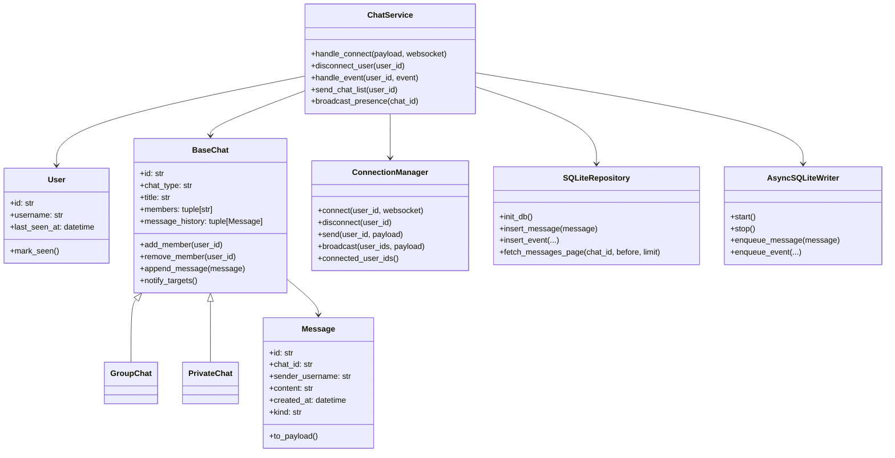
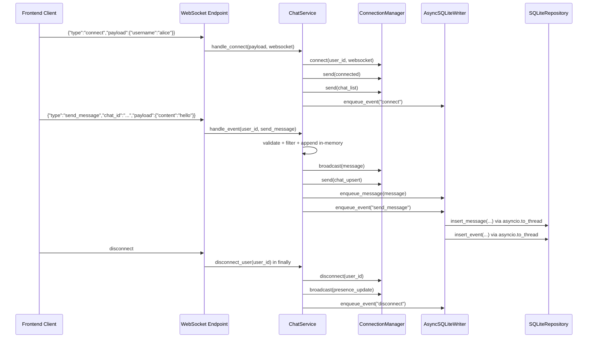

# UML Diagrams

## Class Diagram (Mermaid)

```mermaid
classDiagram
    class User {
      +id: str
      +username: str
      +last_seen_at: datetime
      +mark_seen()
    }

    class Message {
      +id: str
      +chat_id: str
      +sender_username: str
      +content: str
      +created_at: datetime
      +kind: str
      +to_payload()
    }

    class BaseChat {
      +id: str
      +chat_type: str
      +title: str
      +members: tuple[str]
      +message_history: tuple[Message]
      +add_member(user_id)
      +remove_member(user_id)
      +append_message(message)
      +notify_targets()
    }

    class GroupChat
    class PrivateChat
    BaseChat <|-- GroupChat
    BaseChat <|-- PrivateChat

    class ConnectionManager {
      +connect(user_id, websocket)
      +disconnect(user_id)
      +send(user_id, payload)
      +broadcast(user_ids, payload)
      +connected_user_ids()
    }

    class SQLiteRepository {
      +init_db()
      +insert_message(message)
      +insert_event(...)
      +fetch_messages_page(chat_id, before, limit)
    }

    class AsyncSQLiteWriter {
      +start()
      +stop()
      +enqueue_message(message)
      +enqueue_event(...)
    }

    class ChatService {
      +handle_connect(payload, websocket)
      +disconnect_user(user_id)
      +handle_event(user_id, event)
      +send_chat_list(user_id)
      +broadcast_presence(chat_id)
    }

    ChatService --> ConnectionManager
    ChatService --> SQLiteRepository
    ChatService --> AsyncSQLiteWriter
    ChatService --> BaseChat
    ChatService --> User
    BaseChat --> Message
```

## Sequence Diagram (Mermaid)

```mermaid
sequenceDiagram
    participant UI as Frontend Client
    participant WS as WebSocket Endpoint
    participant S as ChatService
    participant CM as ConnectionManager
    participant W as AsyncSQLiteWriter
    participant DB as SQLiteRepository

    UI->>WS: {"type":"connect","payload":{"username":"alice"}}
    WS->>S: handle_connect(payload, websocket)
    S->>CM: connect(user_id, websocket)
    S->>CM: send(connected)
    S->>CM: send(chat_list)
    S->>W: enqueue_event("connect")

    UI->>WS: {"type":"send_message","chat_id":"...","payload":{"content":"hello"}}
    WS->>S: handle_event(user_id, send_message)
    S->>S: validate + filter + append in-memory
    S->>CM: broadcast(message)
    S->>CM: send(chat_upsert)
    S->>W: enqueue_message(message)
    S->>W: enqueue_event("send_message")

    W->>DB: insert_message(...) via asyncio.to_thread
    W->>DB: insert_event(...) via asyncio.to_thread

    UI->>WS: disconnect
    WS->>S: disconnect_user(user_id) in finally
    S->>CM: disconnect(user_id)
    S->>CM: broadcast(presence_update)
    S->>W: enqueue_event("disconnect")
```
